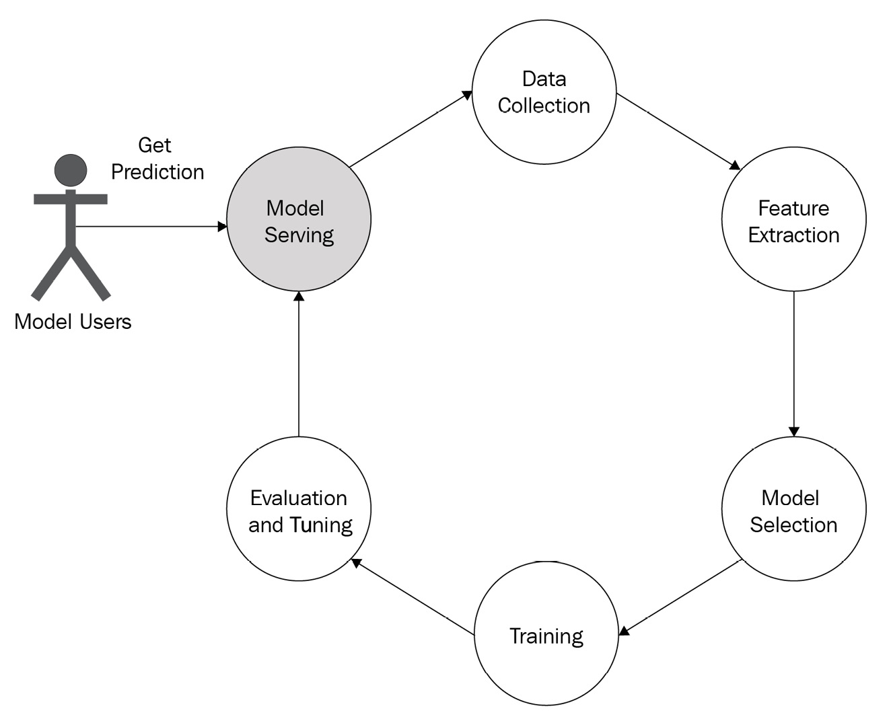

# What is model serving?

### Serving / Model / Model serving
 

### The steps of model serving
 

1. Saving the trained model
    - The model saved format can be different based on the serving tool.
        > ex) <https://kserve.github.io/website/0.9/modelserving/servingruntimes/>
1. Annotate the access points
1. Deploy the saved model to a model-serving tool
1. Version controlling of the model

 

### The importance of model serving
 
(image source : "Machine Learning Model Serving Patterns and Best Practice")

 

- Challenges
    - Choice of tool
    - Versioning
    - Rollback
 

- Serving tools
    - BentoML (https://www.bentoml.com/)
    - MLflow (https://mlflow.org/)
    - <u>__KServe__ (https://kserve.github.io/website/0.9/)</u>
    - Seldon core (https://www.seldon.io/solutions/open-source-projects/core)
    - Cortex (https://www.cortex.dev/)
    - TensorFlow Serving (https://www.tensorflow.org/tfx/guide/serving)
    - TorchServe (https://pytorch.org/serve/index.html)
    - Ray Serve (https://www.ray.io/ray-serve)
    - Multi Model Server (MMS) (https://github.com/awslabs/multi-model-server)
    - ForestFlow (https://github.com/ForestFlow/ForestFlow)
    - DeepDetect (https://www.deepdetect.com/overview/introduction)
    - Some examples of app-serving tools are CoreML and TensorFlow.js
