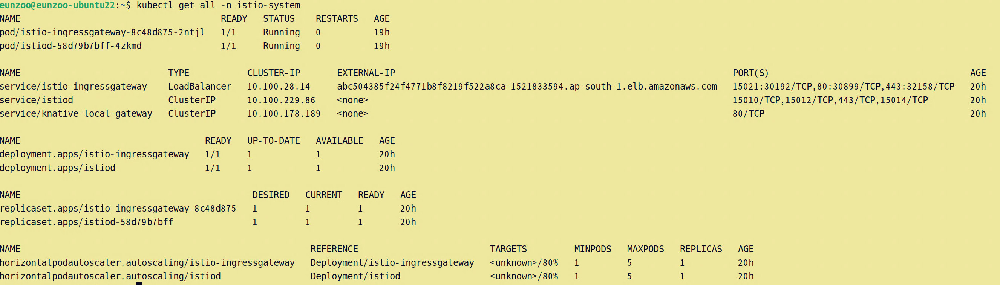
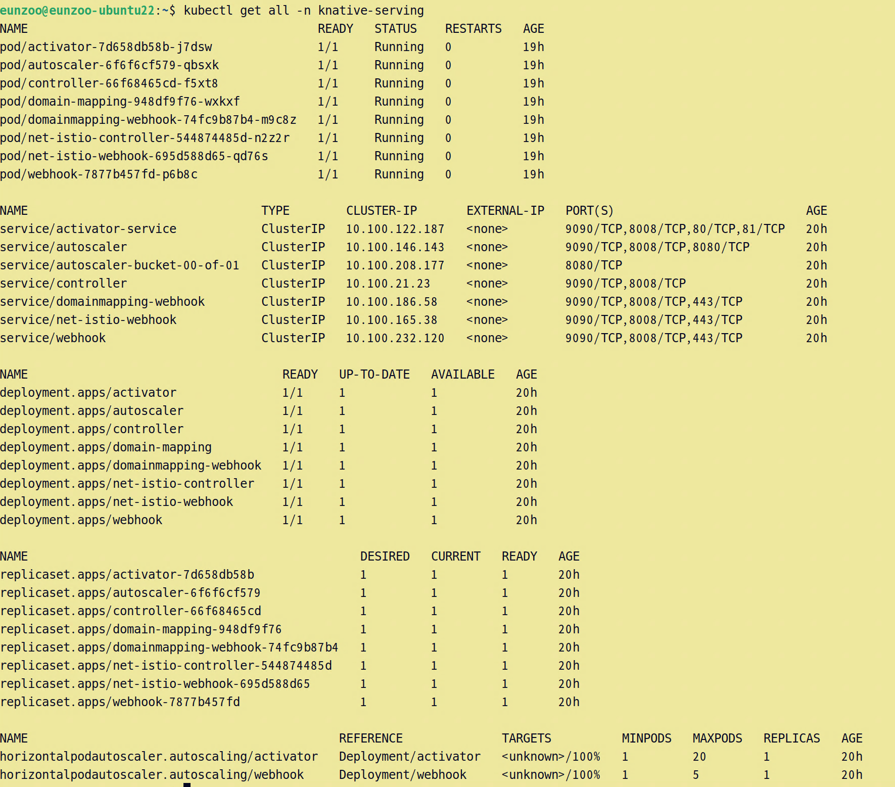
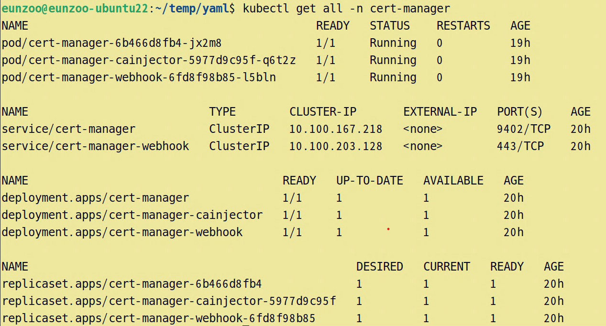
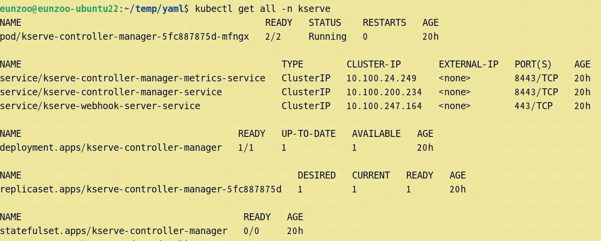

# Installation

> documentation : https://kserve.github.io/website/0.9/admin/serverless

0. Version

    | Kubernetes | Istio | Knative | Cert Manager |
    |:---:|:---:|:---:|:---:|
    | 1.22 | 1.12.1 | 1.5.0 | 1.10.2 | 

1. Istio
    - install `istioctl`
        ```
        curl -L https://istio.io/downloadIstio | ISTIO_VERSION=1.12.1 TARGET_ARCH=x86_64 sh -
        ```
    - installing istio without sidecar injection
        ```
        istioctl install set Values.global.proxy.autoInject=disabled
        ```
        
</br>

2. Knative Serving
    - install custom resources
        ```
        kubectl apply -f https://github.com/knative/serving/releases/download/knative-v1.5.0/serving-crds.yaml
        ```
    - install core components
        ```
        kubectl apply -f https://github.com/knative/serving/releases/download/knative-v1.5.0/serving-core.yaml
        ```
    - install the Knative istio controller for a networking layer
        ```
        kubectl apply -f https://github.com/knative-sandbox/net-istio/releases/download/knative-v1.5.0/net-istio.yaml        
        ```
        - check the gateway selector
            > knative-ingress-gateway  
            > knative-local-gateway
            ```yaml
            spec:
              selector:
                istio: ingressgateway
            ```
    - configure DNS
        - create a CNAME record in AWS Route 53
            ```
            *.knative.dtmlops.click == CNAME a26a7ee5110fe44ffaa14f3f2f56f633-1154649046.ap-south-1.elb.amazonaws.com
            ```
        - update config-domain
            ```
            kubectl patch configmap/config-domain \
                --namespace knative-serving \
                --type merge \
                --patch '{"data":{"knative.dtmlops.click":""}}'
            ```
        - update config-network
            ```
            kubectl patch configmap/config-network \
                --namespace knative-serving \
                --type merge \
                --patch '{"data":{"domain-template":"{{.Name}}.{{.Namespace}}.{{.Domain}}"}}'
            ```
            
        
</br>

3. Cert Manager
    - Default static install
        ```
        kubectl apply -f https://github.com/cert-manager/cert-manager/releases/download/v1.10.2/cert-manager.yaml
        ```
        
</br>

4. KServe
    - install crd & components
        ```
        kubectl apply -f https://github.com/kserve/kserve/releases/download/v0.9.0/kserve.yaml
        ```
    - install built-in clusterservingruntimes
        ```
        kubectl apply -f https://github.com/kserve/kserve/releases/download/v0.9.0/kserve-runtimes.yaml
        ```
        
</br>

5. Uninstallation
    - Manually delete the `clusterrole`, `clusterrolebinding`, `customresourcedefinition` resources.
