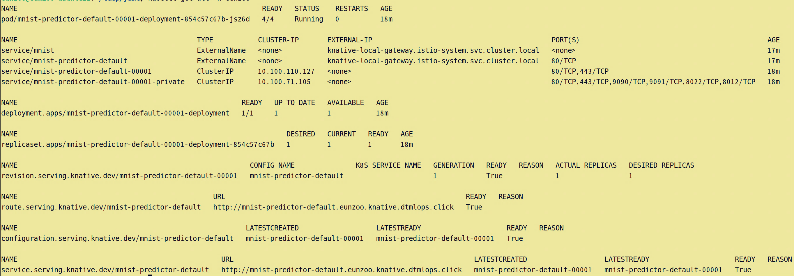

# KServe sample

### 0. reference : https://github.com/theofpa/kserve-tutorial
</br>

### 1. mnist_test.yaml
```yaml
apiVersion: "serving.kserve.io/v1beta1"
kind: "InferenceService"
metadata:
  name: "mnist"
  namespace: eunzoo
spec:
  predictor:
    model:
      modelFormat:
        name: tensorflow
        version: "2"
      storageUri: "gs://kserve/models/mnist"
      runtime: kserve-tensorflow-serving
    logger:
      mode: all
```
### 2. kubectl apply

</br>

### 3. inferenceservice 
```
mnist   http://mnist.eunzoo.knative.dtmlops.click  
```

### 4. route
```
mnist-predictor-default   http://mnist-predictor-default.eunzoo.knative.dtmlops.click 
```

### 5. predict
```
curl http://mnist-predictor-default.eunzoo.knative.dtmlops.click/v1/models/mnist:predict \
-H 'Content-Type: application/json' \
-d @mnist.json
```